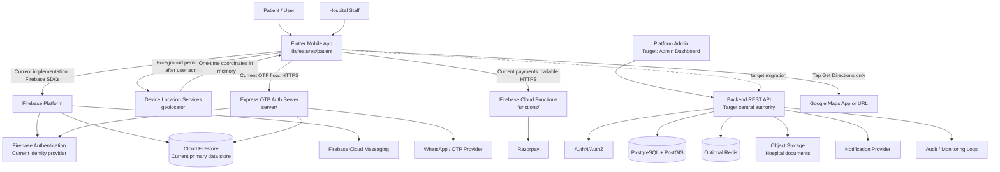

# ojao High-Level Architecture

## 1. Scope and Architectural Direction

ojao is currently a Flutter mobile application for healthcare facility discovery, virtual queues, appointments, staff operations, analytics, payments, notifications, and video consultation. The current implementation uses Firebase directly from the mobile app for most application data, with a small self-hosted Express service for OTP authentication and Firebase callable functions for payments.

The requested architecture establishes a clearer long-term boundary:

```text
Cross-platform Mobile App
        |
        | HTTPS REST API
        v
Backend API / Application Services
        |
        +--> Authentication and Authorization
        +--> Hospital Discovery / Nearby Search
        +--> Hospital Registration and Verification
        +--> Queue, Appointment, Payment, and Notification Workflows
        +--> PostgreSQL + PostGIS
        +--> Object Storage for Verification Documents
        +--> Optional Redis Cache

Get Directions is an external action from the mobile app to Google Maps.
```

This should be treated as a **target architecture**. The repository has not yet migrated from Firebase/Firestore to PostgreSQL/PostGIS, and it does not yet contain a hospital admin dashboard or a complete REST API for core application data.

## 2. Current-to-Target System Diagram



The diagram intentionally shows both states. Firebase is the live repository architecture; the REST/PostGIS branch is the recommended migration target and the boundary for new server-owned workflows.

## 3. Component Responsibilities

### Mobile Application

**Implementation:** Flutter, Riverpod, GoRouter.

**Source locations:**

- `lib/main.dart` initializes Firebase, notifications, and the application shell.
- `lib/core/router/app_router.dart` defines authentication and patient/staff navigation.
- `lib/features/auth/` contains login, registration, OTP, password reset, and Google sign-in flows.
- `lib/features/patient/` contains facility discovery, location, queues, appointments, profile, and video consultation UI.
- `lib/features/staff/` contains staff dashboard, queue operations, token details, and analytics.
- `lib/data/services/` contains Firebase, authentication, location, queue, appointment, payment, notification, and facility data access.

The mobile app should:

- Request foreground location only after an explicit action such as “Find hospitals near me”.
- Retrieve one location fix and keep it in application memory for the search.
- Send coordinates only to the backend search endpoint in the target architecture.
- Display only active, verified hospitals returned by the backend.
- Show approximate distance supplied by the backend rather than calculating the authoritative result locally.
- Support manual city, postal-code, or address fallback.
- Call a hospital using the returned phone number.
- Open Google Maps only when the user selects directions.
- Store access and refresh tokens in platform secure storage after the REST migration.

Current behavior differs in two important ways: facilities are read from Firestore and distance is calculated/sorted in `lib/features/patient/application/facility_browse_providers.dart` using coordinates from `Facility`.

### Backend API

**Current implementation:**

- `server/server.js` exposes `/health`, `/auth/send-otp`, `/auth/register`, and `/auth/reset-password`.
- `functions/index.js` exposes callable Razorpay order and payment verification functions and re-exports OTP functions.
- There is no general REST API for facilities, departments, queues, appointments, or analytics.

**Target responsibility:** centralize application logic behind a versioned REST API. Start as one backend service. Do not split into microservices until scale or ownership requires it.

Suggested internal modules:

```text
API Service
├── Auth module
├── Hospital discovery module
├── Hospital profile and services module
├── Hospital application / verification module
├── Queue and appointment module
├── Payment module
├── Notification module
├── Audit module
└── Rate limiting / request validation
```

The API must validate input, enforce roles and hospital ownership, apply rate limits, hide unapproved hospitals, and avoid logging exact patient coordinates.

### Authentication and Authorization

Current roles are `patient`, `staff`, and `admin` in `lib/data/models/user_model.dart`. The target role vocabulary should map these to `USER`, `HOSPITAL_ADMIN`, and `PLATFORM_ADMIN`, with an explicit hospital membership or assignment rather than the ambiguous `clinicId` field.

Current authentication is split between Firebase Auth, a self-hosted Express OTP server, and legacy Firebase phone auth. The target architecture should select one authoritative authentication flow and expose it through the API. Short-lived access tokens, securely stored refresh tokens, MFA or stronger authentication for hospital/platform administrators, and server-side role checks are required.

### Hospital Discovery and Nearby Search

The target API endpoint is:

```text
GET /api/v1/hospitals/nearby?latitude={lat}&longitude={lng}&radiusMeters={radius}
```

Server rules:

- Latitude must be between `-90` and `90`.
- Longitude must be between `-180` and `180`.
- Radius must be bounded, for example to `50,000` meters.
- Results must be limited, for example to `100` per request.
- Only `is_active = true` and `is_verified = true` hospitals are searchable.
- Results are ordered by PostGIS distance and paginated.
- Response data is restricted to fields required by the mobile app.

The authoritative distance calculation belongs in the backend. The existing client-side distance utility is useful during migration but should not remain the source of truth after the API is introduced.

### Hospital Verification and Administration

The target architecture requires an admin surface that is not present in the repository today. It should support:

- Reviewing hospital applications and submitted documents.
- Approving, rejecting, or suspending a hospital.
- Editing and confirming hospital coordinates.
- Managing hospital services.
- Restricting hospital administrators to their own records.
- Recording every decision and profile change in audit logs.

The current staff screens (`lib/features/staff/`) operate queue and analytics workflows but are not a platform verification dashboard.

### Notifications

The current client initializes Firebase Cloud Messaging and foreground local notifications in `lib/data/services/fcm_service.dart`. The target backend should own notification dispatch for queue calls, appointment reminders, verification outcomes, and operational events. Device tokens should be registered through an authenticated API endpoint and never treated as trusted client-supplied identity data.

### Google Maps

Google Maps is deliberately outside the primary search path. The mobile app should construct a destination URL from the verified hospital coordinates only after the user taps directions:

```text
https://www.google.com/maps/dir/?api=1&destination=LATITUDE,LONGITUDE
```

No map tiles, embedded map SDK, route API call, or per-result directions lookup is needed. If the native app is unavailable, open the same URL in a browser or use the platform fallback.

## 4. Target Data Architecture

### Recommended PostgreSQL/PostGIS Schema

```text
users
  id, name, email, phone, password_hash, role, status, created_at, updated_at

hospitals
  id, legal_name, display_name, description, phone, emergency_phone, email,
  address_line_1, address_line_2, city, state, postal_code, country,
  location geography(Point, 4326), emergency_available, is_active, is_verified,
  verified_at, created_at, updated_at

hospital_services
  id, hospital_id, service_type, service_name, is_available, description,
  created_at, updated_at

hospital_applications
  id, applicant_user_id, hospital_name, submitted_address, submitted_phone,
  submitted_documents, submitted_location, status, review_notes, reviewed_by,
  reviewed_at, created_at, updated_at

audit_logs
  id, actor_user_id, action, entity_type, entity_id, metadata, created_at
```

Use a GiST spatial index:

```sql
CREATE INDEX hospitals_location_idx
ON hospitals
USING GIST (location);
```

The nearby query should use `ST_DWithin` for the radius filter and `ST_Distance` for ordering. Coordinates are stored as longitude/latitude in the PostGIS point, with SRID `4326` and geography semantics for meter-based distance.

### Current Firestore Mapping

The current primary store is Cloud Firestore, with paths centralized in `lib/data/services/firestore_service.dart`:

```text
users/{uid}
facilities/{facilityId}
facilities/{facilityId}/departments/{departmentId}
facilities/{facilityId}/tokens/{tokenId}
facilities/{facilityId}/positions/{positionId}
facilities/{facilityId}/appointments/{appointmentId}
facilities/{facilityId}/payments/{paymentId}
facilities/{facilityId}/analytics/current
otp_requests/{mobile}
```

The current `Facility` model stores scalar `latitude` and `longitude`, and `FacilityService.watchFacilities()` reads all active facilities. This is suitable for the current MVP but does not provide server-side spatial filtering equivalent to PostGIS.

The migration should define a stable ID mapping between `facilities` and `hospitals`, preserve queue/appointment/payment history, and migrate `clinicId` to an explicit `hospital_id` or membership relation.

## 5. Security, Privacy, and Operational Controls

- Enforce HTTPS between mobile clients, admin clients, and the API.
- Validate every coordinate, radius, pagination, status, and uploaded document server-side.
- Apply per-user, device, and IP rate limits to nearby search and OTP operations.
- Never trust `is_verified`, `is_active`, role, or hospital ownership values from clients.
- Do not store exact user coordinates in ordinary application logs or analytics.
- Retain location in memory for the current request unless a documented product requirement requires persistence.
- Store verification documents in private object storage with short-lived signed access URLs.
- Hash passwords and OTP values; expire OTPs and cap verification attempts.
- Record security-sensitive events such as login failures, approvals, rejections, suspensions, profile changes, and payment verification failures.
- Review the repository for service-account JSON files and keep credentials outside version control.

The current Firestore rules in `firestore.rules` do enforce some user/facility ownership boundaries, but the target API must become the trusted policy enforcement point after migration.

## 6. Deployment Topology

```text
iOS / Android Flutter App
          |
       HTTPS
          |
API Gateway / Load Balancer
          |
   Backend API Instances
       |       |       |
       |       |       +--> Email / SMS / Push Provider
       |       +----------> Object Storage
       +------------------> PostgreSQL + PostGIS
                  \-------> Optional Redis

Admin Dashboard -- HTTPS --> Backend API
```

Recommended first production shape:

- One backend service deployed to Cloud Run, ECS, Render, Railway, Fly.io, or an equivalent managed runtime.
- Managed PostgreSQL with PostGIS.
- Private S3-compatible object storage for documents.
- Redis only when measured search volume or repeated geographic queries justify it.
- Sentry/provider metrics for monitoring and alerting.
- GitHub Actions or equivalent CI/CD.
- Deployment secret manager or environment variables, never mobile-bundled secrets.

The existing deployment is split between Firebase and an EC2/Nginx/PM2 Express auth service documented under `server/`. Consolidating the API boundary should reduce this operational duplication.

## 7. API Surface

### Authentication

```text
POST /api/v1/auth/register
POST /api/v1/auth/login
POST /api/v1/auth/refresh
POST /api/v1/auth/logout
```

### Hospital Discovery and Profiles

```text
GET   /api/v1/hospitals/nearby
GET   /api/v1/hospitals/{hospitalId}
PATCH /api/v1/hospitals/{hospitalId}
```

### Hospital Registration and Verification

```text
POST /api/v1/hospital-applications
GET  /api/v1/hospital-applications/{applicationId}
POST /api/v1/hospitals/{hospitalId}/documents
GET  /api/v1/admin/hospital-applications
POST /api/v1/admin/hospital-applications/{id}/approve
POST /api/v1/admin/hospital-applications/{id}/reject
```

Queue, appointments, payments, notification registration, and staff management should follow the same `/api/v1` boundary as those features move away from direct Firestore access.

## 8. Delivery Sequence

1. Stabilize the existing Firebase MVP and document the current Firestore model.
2. Choose one authentication provider and remove the competing OTP path.
3. Introduce a backend API facade for hospital discovery without changing the mobile UX.
4. Move hospital records and nearby search to PostgreSQL/PostGIS.
5. Add hospital applications, document storage, verification roles, and an admin dashboard.
6. Move queue, appointment, payment, and notification mutations behind the API.
7. Add coarse-location Redis caching only after measuring demand.
8. Retire direct mobile Firestore access once all required flows are API-backed.

## 9. Current Gaps Against the Target

- No PostgreSQL/PostGIS schema or migration exists.
- No REST endpoint for nearby hospitals exists; current facility discovery uses Firestore and client-side sorting.
- No admin dashboard or hospital verification workflow exists.
- No hospital application/document model exists in the current source tree.
- Google Maps directions integration is not currently implemented.
- Firebase Auth, Express OTP, Firebase callable OTP, and legacy phone auth coexist and should be consolidated.
- Staff/admin roles are currently combined in the staff console and use `clinicId` rather than an explicit hospital membership.
- No automated Flutter, API, or Firestore rules test suite was found.
- Queue and appointment writes are still largely client-driven and need trusted server-side transactions for production correctness.
